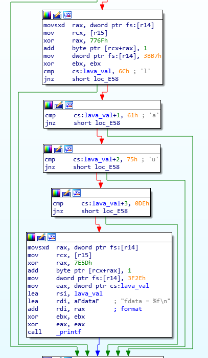
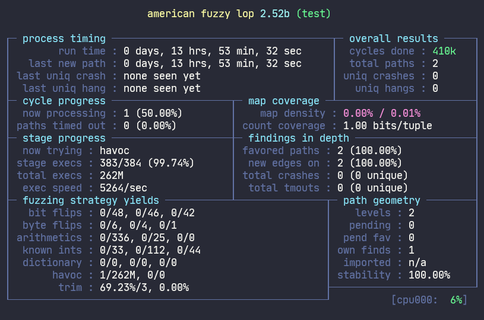
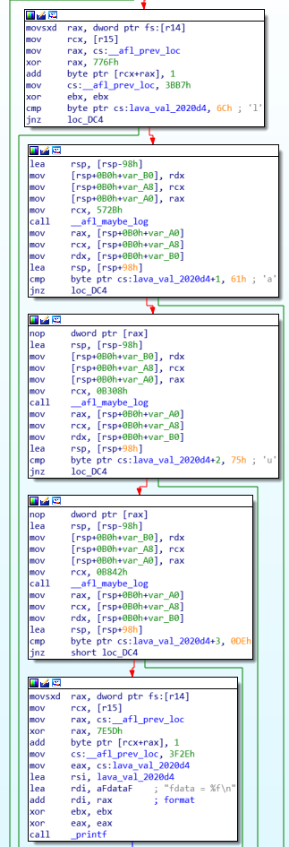
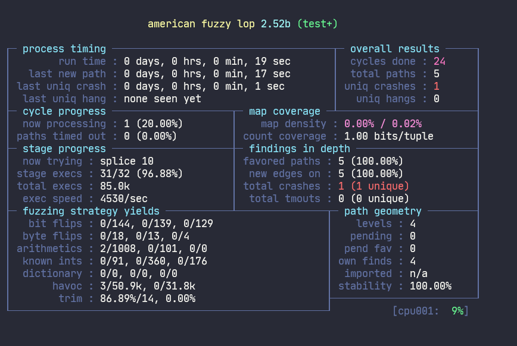

# Motivation Example
## MIL errors
If we compile the test.c with afl-clang-fast of AFL 2.52b, we would find that it misses some instrumentations.  
 

Furthermore, if we fuzz this simple program, AFL could not find the crash within 12 hours later.


## Fix it with our tool
```
$ ./fix/retrowrite/retrowrite example/test example/test.s
$ python ./fix/fix_asm.py --asm_file example/test.s --instru_info example/test_instru.json -O example/test+.s
$ ./fix/aflig/afl-ig ./example/test+.s -o ./example/test+
```
We could fix the instrumentation errors.  


AFL could trigger the crash within 1 min.


<!-- ## How about other fuzzers? -->
